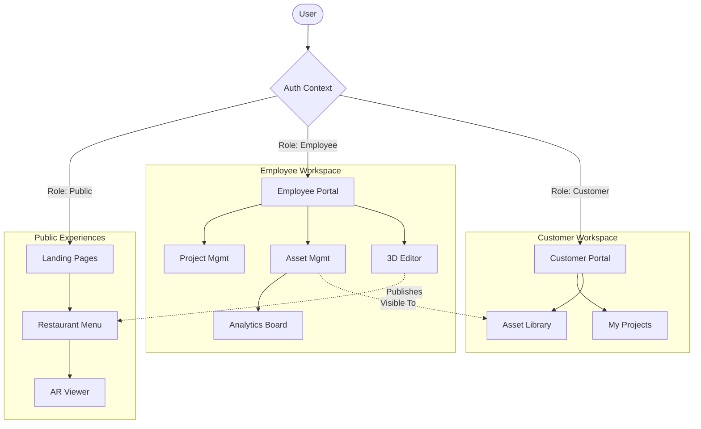

<div align="center">

</div>

# Managed Capture 3D Platform

> **Enterprise-Grade 3D Photogrammetry Management System**
>
> A modern, full-featured web application designed to bridge the gap between physical objects and digital experiences. This platform enables technicians to upload and manage 3D captures while providing clients with a seamless dashboard to review and publish their assets.

[](https://react.dev/)
[](https://www.typescriptlang.org/)
[](https://vitejs.dev/)
[](https://tailwindcss.com/)

## ✨ Key Features

### 🏢 Employee Portal (Admin & Technicians)

- **Dashboard Command Center**: Real-time overview of active projects and asset status.
- **Advanced Asset Management**: Centralized repository for all 3D models with search and filtering.
- **Analytics Board**: Visualization of total views, unique visitors, and engagement metrics.
- **Client Management**: Tools to manage customer profiles and project assignments.

### 👤 Customer Portal (Clients)

- **Project Progress Tracker**: Live status updates from "Intake" to "Delivery".
- **Asset Review**: Interactive grid to view, approve, or request changes to 3D assets.
- **Support Integration**: Direct channel for support and new capture requests.

### 🎨 3D Editor & Menu Builder

- **Scene Dashboard**: Split-screen editor for fine-tuning 3D model presentation.
- **Menu Settings**: Live customization of brand colors, fonts, and currency for public menus.
- **QR Code Generator**: Instantly generate physical QR codes for table tents and marketing materials.
- **AR Experience**: Built-in Augmented Reality support for mobile users.

## 🏗️ Architecture

The application is structured around three core functional zones:



## 🚀 Quick Start

### Prerequisites

- **Node.js** (v18 or higher)
- **npm** or **yarn**

### Installation

1. **Clone the repository**

   ```bash
   git clone <repository-url>
   cd managed-capture-3d-platform
   ```

2. **Install dependencies**

   ```bash
   npm install
   ```

3. **Start the development server**

   ```bash
   npm run dev
   ```

4. **Navigate to the app**
   Open `http://localhost:3000` in your browser.

## 🔐 Mock Authentication

The application uses a robust **mock authentication system** for MVP development. No backend is required.

### Demo Credentials

| Role              | Email               | Permissions                     |
| ----------------- | ------------------- | ------------------------------- |
| **Project Owner** | `client@bistro.com` | View Dashboard, Approve Assets  |
| **Team Member**   | `admin@company.com` | Full System Access, Edit Models |
| **Technician**    | `tech@company.com`  | Upload Assets, Basic Editing    |

_Note: Any password will work for these accounts._

## 📁 Project Structure

```
src/
├── components/           # Reusable UI components
│   ├── portal/           # Dashboard-specific widgets (Tables, KPIs)
│   ├── editor/           # 3D Editor tools and overlays
│   └── ...
├── pages/                # Route specific pages
│   ├── templates/        # Public facing templates (Menu, Gallery)
│   ├── editor/           # Asset editing environment
│   └── Portal.tsx        # Main dashboard controller
├── services/
│   └── mockData.ts       # In-memory data store for MVP
├── contexts/             # Global state (Auth, Theme, Toast)
├── types/                # TypeScript definitions
└── ...
```

## 🛠️ Technology Stack

- **Frontend Framework**: React 19
- **Build Tool**: Vite
- **Styling**: Tailwind CSS + Lucide Icons
- **3D Engine**: `<model-viewer>` (Google)
- **Routing**: React Router 7
- **Code Quality**: ESLint + Prettier

## 🌙 Dark Mode

The platform features a system-aware dark mode that is consistent across all screens, including the dashboard, editor, and public menu templates.

---

<div align="center">
Made with ❤️ by the Managed Capture Team
</div>
